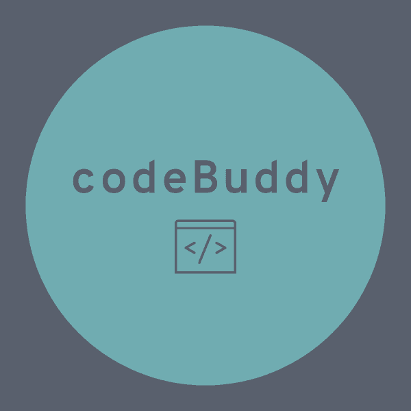

  

# CodeBuddy

CodeBuddy is an algorithm library for the Atom editor. The package includes templates for widely used algorithms in computer science along with common operations in a variety of languages, along with features allowing the user to quickly and easily incorporate these into their project.

### Implemented Algorithms:  
- sorting algorithms
- file i/o
- searching algorithm
- common mathematical functions (fibonacci, etc...)

For further details on the available algorithms for each language, see the appropriate `*_algorithms.txt` file where `*` is the name of the language to be referenced.  
We plan to cover as many algorithms as we can from [this](https://www.geeksforgeeks.org/top-algorithms-and-data-structures-for-competitive-programming/) webpage.  
If there are other algorithms you'd like to see implemented, feel free to open an issue or a pull request if you have an implementation you'd like to add.

### Community:
For more information on contributing, where to find help, and our code of conduct, visit our [website](https://codebuddypackage.weebly.com/).
